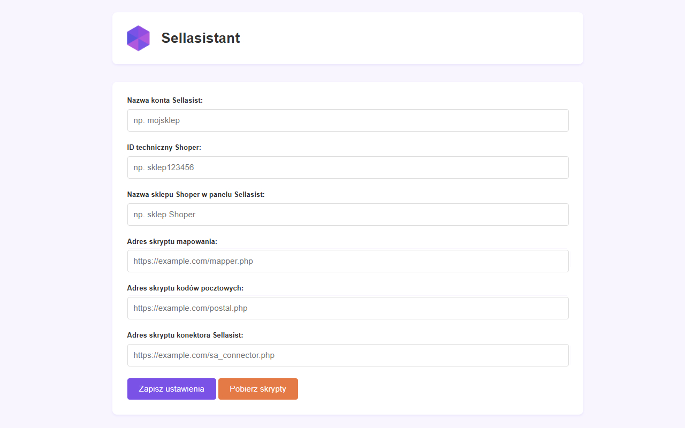
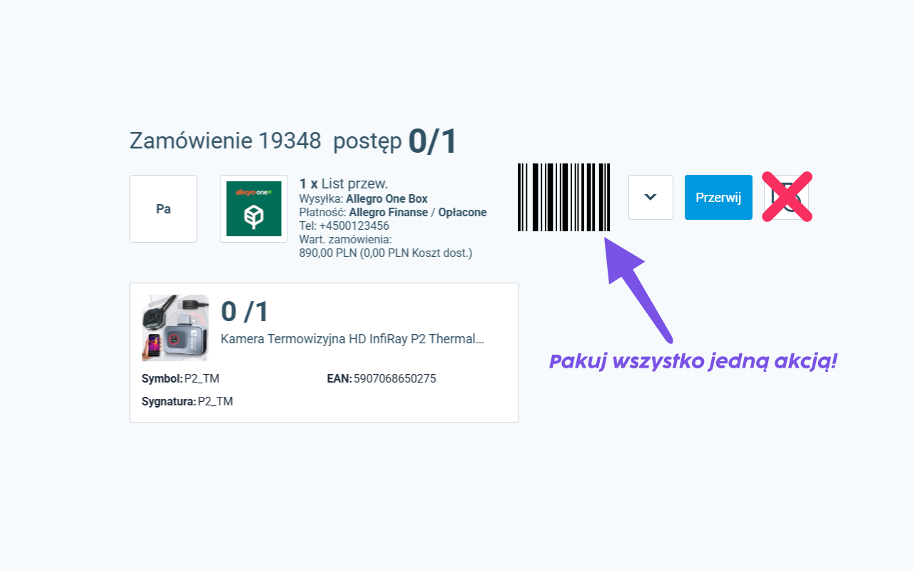

# Sellasistant

Rozszerzenie dodaje szereg funkcjonalności ułatwiających pracę z Sellasistem.

**Dodatkowe skrypty do pracy z rozszerzeniem do pobrania na <a class="paragraph-link" href="https://github.com/oh1apps/sellasistant_scripts">GitHub</a>**

## Przed pierwszym użyciem rozszerzenie należy skonfigurować przechodząc do jego ustawień.

***

## Funkcje

### Łączenie produktów
Umożliwia łatwe łączenie produktów z magazynu Sellasist z produktami ze sklepu Shoper. Po połączeniu, z listy towarów w SA można przejść bezpośrednio do strony produktu w sklepie lub do strony edycji w panelu administracyjnym. Obsługiwane są zarówno produkty jak i warianty produktów (po stronie Shopera).

⚠️**Wymaga dodatkowego skryptu**

***

### Ukrywanie przycisków
Na stronie ręcznego zamawiania przesyłki do zamówienia ukrywa przyciski zapisywania i usuwania szablonów

***

### Wspomaganie zwrotów
W zwrotach podświetla opłacone zamówienia i w przypadku zamówień Allegro dodaje link do loginu kupującego kierujący na stronę zamówienia w serwisie aukcyjnym

***

### Pakowanie kodem
Na ekranie pakowania oznacza zamówienie jako spakowane w całości - po zeskanowaniu kodu kreskowego lub wciśnięciu klawisza x

***

### Kody pocztowe
Po wpisaniu kodu pocztowego na stronie zamówienia automatycznie uzupełnia nazwę miejscowości

⚠️**Wymaga dodatkowego skryptu**

***

### Responso
Dla klientów z Allegro dodaje panel Responso na stronie zamówienia

